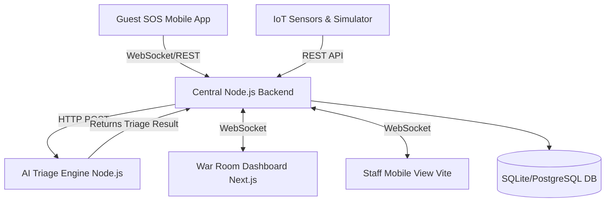
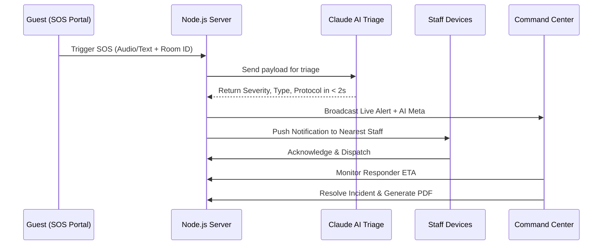

# 🚨 SENTINEL: Rapid Crisis Intelligence Operations

SENTINEL is an AI-powered command center designed for the hospitality industry to bridge guests, hotel staff, and first responders in real time — eliminating data silos that cost lives during emergencies.

---

## 🏗️ System Architecture

The SENTINEL ecosystem consists of multiple interconnected micro-services:



---

## 🔄 Emergency Workflow (60-Second Loop)

The typical response flow happens in less than a minute:



---

## 🚀 Components

1. **Dashboard (Next.js)**: The War Room UI for security operators. Interactive floor maps, active incident feeds, and live AI triage results.
2. **Frontend (Vite)**: Secondary UI / Staff View for real-time mobile tracking and responses.
3. **Backend (Node.js/Express/Prisma)**: Core router handling WebSocket connections, data persistence, and API logic.
4. **AI-Service (Node.js/Express)**: Receives incident descriptions and uses LLM (Claude) to instantly classify the emergency (Fire, Medical, Security, etc.) and assign severity.
5. **Mobile (React Native/Expo)**: The Guest SOS portal and Staff response application.
6. **Simulator**: A testing tool to dispatch fake IoT sensor alerts and SOS triggers into the system for demonstration.

---

## 🛠️ Setup & Local Development

### 1. Backend setup
```bash
cd backend
npm install
# Set up .env variables (PORT, DATABASE_URL, etc.)
npx prisma db push
npm run dev
```

### 2. AI Triage Service
```bash
cd ai-service
npm install
# Set up .env with ANTHROPIC_API_KEY / OPENAI_API_KEY
npm start (or node index.js)
```

### 3. Dashboard
```bash
cd dashboard
npm install
npm run dev
```

---

## 🌐 Environment Variables

To fully run the project, the following `.env` files must be configured across the workspaces:

### `backend/.env`
- `PORT=3001`
- `DATABASE_URL="file:./dev.db"` (Use a PostgreSQL connection string like Turso or Supabase for Vercel deployment)
- `JWT_SECRET="your_secret"`

### `ai-service/.env`
- `GROQ_API_KEY` (or the respective LLM API key used for triage)

### `dashboard/.env`
- `NEXT_PUBLIC_BACKEND_URL="http://localhost:3001"` (Point this to your hosted backend when deployed)

---

## 🚀 Deployment (Vercel)

The system is configured as a monorepo for Vercel. By default, the `dashboard` UI is built and deployed. 

*Note: The backend requires a managed database (e.g., Turso, Neon, or Supabase) to be deployed as serverless functions on Vercel since local SQLite files are read-only in serverless environments.*
